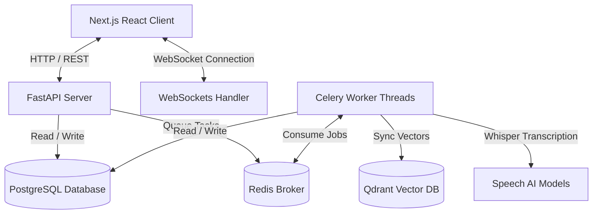

# Briefen — Platform Setup & Engineering Guide (v1.0.0)

Welcome to the **Briefen** core repository. Briefen is an enterprise-grade, multi-tenant meeting intelligence platform designed to transcribe raw team recordings, generate structured notes, map action item checklists, index transcript keywords, and facilitate vector-based semantic AI Q&A search over your entire meeting history.

---

## 1. Project Overview

### Purpose
Briefen aims to automate meeting intelligence and administrative overhead. By leveraging speech-to-text models and semantic search indices, teams can upload audio/video files and instantly extract summaries, key decisions, speaker talking ratios, and follow-up tasks without manual documentation.

### System Architecture
Briefen is built as a split-architecture, asynchronous microservices platform:


### Technical Stack
*   **Frontend**: Next.js 16 (App Router), React, TanStack Query v5, Tailwind CSS v4, Framer Motion.
*   **Backend**: FastAPI, SQLAlchemy (Asyncio), Pydantic v2.
*   **Asynchronous Engine**: Celery, Redis Broker.
*   **Database Systems**: PostgreSQL 18 (Relational schemas), Qdrant (Semantic vector indexes).
*   **AI Engine**: Faster-Whisper (Local CPU speech-to-text transcribers), Google Gemini (Meeting intelligence summaries, tasks, and RAG chat Q&A).

---

## 2. Workspace Folder Structure

```filename
MeetUpAI/
├── src/                    # NEXT.JS FRONTEND SOURCE
│   ├── app/                # Next.js App Router folders
│   │   ├── (app)/          # Protected workspace pages (Dashboard, Meetings, Tasks)
│   │   ├── (auth)/         # Public auth pages (Login, Register, Reset Password)
│   │   └── (marketing)/    # Landing promotional screens
│   ├── components/         # Reusable React UI & Layout elements
│   ├── lib/                # Client state query hooks, API request wrappers
│   └── public/             # Static graphics and UI media
├── backend/                # FASTAPI BACKEND SOURCE
│   ├── app/
│   │   ├── api/            # API endpoints & WebSocket routing controllers
│   │   ├── core/           # Security, config variables, database setups, seeders
│   │   ├── models/         # SQLAlchemy DB model classes
│   │   ├── repositories/   # Database query abstractions
│   │   ├── schemas/        # Pydantic schema validation structures
│   │   ├── services/       # AI Whisper transcribers and semantic embedders
│   │   └── tasks/          # Celery asynchronous meeting processing worker jobs
│   ├── alembic/            # SQLAlchemy database migration scripts
│   └── tests/              # Pytest backend validation suites
└── docker-compose.yml      # Multi-service infrastructure orchestration
```

---

## 3. Prerequisites

Before cloning and spinning up the application, ensure the following core tools are installed locally:

| Dependency | Minimum Version | Purpose |
| :--- | :--- | :--- |
| **Node.js** | `v20.x` (LTS) | Runtime engine for the Next.js React client |
| **npm / pnpm** | `npm v10.x` | Packages manager for JavaScript dependencies |
| **Python** | `v3.12.x` | Runtime for FastAPI and Celery workers |
| **PostgreSQL** | `v17.x` / `v18.x` | Relational database schema engine |
| **Redis** | `v7.x` | Message broker for Celery queue & WebSocket pub/sub |
| **Docker Desktop**| `v4.30+` | Hosts isolated container instances (Qdrant, Redis, Postgres) |
| **VS Code** | Latest | Recommended Integrated Development Environment (IDE) |
| **Google Chrome** | Latest | Web client layout verification and execution |

---

## 4. Recommended VS Code Extensions

Install the following extensions to maintain project formatting guidelines and debugger pipelines:
*   **Python (`ms-python.python`)**: Rich linting, debugging, and import sorting.
*   **Pylance (`ms-python.vscode-pylance`)**: Static type checking and Python analysis.
*   **ESLint (`dbaeumer.vscode-eslint`)**: Frontend JavaScript/TypeScript code quality rules.
*   **Prettier - Code formatter (`esbenp.prettier-vscode`)**: Ensures layout aesthetics compliance.
*   **Tailwind CSS IntelliSense (`bradlc.vscode-tailwindcss`)**: Autocomplete for utility variables.
*   **Docker (`ms-azuretools.vscode-docker`)**: Inspect, manage, and scale active service containers.
*   **GitLens (`eamodio.gitlens`)**: Interactive git histories and line blames.
*   **Thunder Client (`rangav.vscode-thunder-client`)**: In-editor REST API test harness.
*   **Error Lens (`usernamehw.errorlens`)**: Highlights compilation warnings inline immediately.
*   **DotENV (`mikestead.dotenv`)**: Syntax highlighting for `.env` credentials config files.

---

## 5. Environment Variables Configuration

Create the respective `.env` files in their corresponding directories before starting services.

### Backend Configurations
Create a `.env` file under `backend/.env`:
```env
# App Configuration
APP_NAME="Briefen API"
APP_ENV=development
DEBUG=true
API_V1_STR=/api/v1

# Security Settings
JWT_SECRET_KEY=72a6b29d109283f3e0c03da872f2e0a29f8d1c92a01e0c6518a28e3b2e9d7c0f
JWT_REFRESH_SECRET_KEY=9a2b8e3d02f82c0c1b7a2d8e3f2e0c19a2b8d0c1d2e3f4a5b6c7d8e9f0a1b2c3
ACCESS_TOKEN_EXPIRE_MINUTES=30
REFRESH_TOKEN_EXPIRE_DAYS=7
ALGORITHM=HS256

# Database Settings
POSTGRES_SERVER=127.0.0.1
POSTGRES_USER=postgres
POSTGRES_DB=briefen_db
POSTGRES_PORT=5433
DATABASE_URL=postgresql+asyncpg://postgres@127.0.0.1:5433/briefen_db

# Redis Settings
REDIS_URL=redis://127.0.0.1:6379/0

# Vector Database (Qdrant) Configuration
QDRANT_HOST=localhost
QDRANT_PORT=6333

# Storage Configuration
UPLOAD_DIR=./uploads
MAX_UPLOAD_SIZE=52428800
STORAGE_PROVIDER=local
CLOUDINARY_CLOUD_NAME=
CLOUDINARY_API_KEY=
CLOUDINARY_API_SECRET=

# Third-Party AI Integration
GEMINI_API_KEY=
```

### Frontend Configurations
Create a `.env.local` file under the workspace root (`./.env.local`):
```env
# Client Application URLs
NEXT_PUBLIC_API_URL=http://localhost:8000/api/v1
NEXT_PUBLIC_WS_URL=ws://localhost:8000/ws
```

### Variable Explanations
*   **`JWT_SECRET_KEY`**: Cryptographic secret used to sign short-lived session access tokens.
*   **`JWT_REFRESH_SECRET_KEY`**: Cryptographic signature key to sign refresh tokens.
*   **`DATABASE_URL`**: SQLAlchemy connection string. Note that port **`5433`** must be used for local development, as PostgreSQL 18 is initialized directly on port `5433` in the workspace context.
*   **`REDIS_URL`**: Address broker connection string. Used for Celery job queues and WebSocket synchronization channels.
*   **`UPLOAD_DIR`**: Relative path for temporary audio/video file storage before transcription processing.
*   **`MAX_UPLOAD_SIZE`**: File size limit in bytes (e.g. `52428800` bytes = 50 MB limit).

---

## 6. Infrastructure Services Setup

### Database (PostgreSQL 18)
The project is configured to run PostgreSQL directly inside the workspace directory cluster (e.g. `backend/data`) on port **`5433`** utilizing `trust` local authorization methods.

1.  **Start Database Cluster**:
    Ensure the DB cluster daemon is running from the workspace:
    ```powershell
    & "C:\Program Files\PostgreSQL\18\bin\postgres.exe" -D "c:\Users\Bhoomi\MeetUpAI\backend\data" -p 5433
    ```
2.  **Verify DB Connectivity**:
    Verify connections can loopback on port `5433`. No password validation is enforced for the local `postgres` superuser on this port.
3.  **Run Alembic Database Migrations**:
    Change directory into `backend/` and run migrations to create the tables schemas:
    ```bash
    python -m alembic upgrade head
    ```

### Redis Broker Setup
Redis acts as the message queue broker for async Celery processing tasks.
*   **Docker installation**:
    ```bash
    docker run -d -p 6379:6379 --name meetmind-redis redis:7-alpine
    ```
*   **Verify Redis status**:
    ```bash
    docker exec -it meetmind-redis redis-cli ping
    # Expected output: PONG
    ```

### Vector Database (Qdrant)
Qdrant manages vector indices for semantic meeting segment searching.
*   **Docker installation**:
    ```bash
    docker run -d -p 6333:6333 -p 6334:6334 --name meetmind-qdrant qdrant/qdrant
    ```

---

## 7. Running the Application

To run the complete system in local development mode, start the processes below in separate terminal windows:

### Phase 1: Launch Backend API Server
1.  Navigate into `backend/` and install dependencies:
    ```bash
    pip install -r requirements.txt
    ```
2.  Start the FastAPI app server:
    ```bash
    python -m uvicorn app.main:app --host 127.0.0.1 --port 8000 --reload
    ```
    Verify Swagger documentation is active at [http://localhost:8000/docs](http://localhost:8000/docs).

### Phase 2: Start Celery Worker Daemon
The Celery workers listen for speech processing, summary analysis, and vector embedder synchronization tasks.
1.  Start the worker task queue thread:
    ```bash
    celery -A app.core.celery_app worker --loglevel=info -P solo
    ```
    *(Note: `-P solo` or `-P gevent` is recommended when running Celery natively inside Windows shells).*

### Phase 3: Launch Next.js React Frontend Client
1.  Navigate to the workspace root directory and install dependencies:
    ```bash
    npm install
    ```
2.  Launch the local dev server:
    ```bash
    npm run dev
    ```
3.  Open browser client at [http://localhost:3000](http://localhost:3000).

---

## 8. Development Lifecycle & CLI Commands

### Running Automated Test Suite
Backend unit tests validate security rules, authentication scopes, API queries, and mock transcribers:
```bash
# Execute within the backend/ folder
python -m pytest -v
```

### Formatting and Linting Checks
To run strict frontend syntax compilation validation checks:
```bash
# Execute within workspace root
npx tsc --noEmit
```

### Alembic Migration Lifecycle
Whenever modifications are applied to database model schemas in `backend/app/models/`:
1.  Generate a new auto-migration script revision:
    ```bash
    python -m alembic revision --autogenerate -m "describe_changes_here"
    ```
2.  Apply the pending revision to the active PostgreSQL database:
    ```bash
    python -m alembic upgrade head
    ```
3.  Rollback the last migration revision (if needed):
    ```bash
    python -m alembic downgrade -1
    ```

---

## 9. Sandbox Demo Account System

Briefen incorporates a sandbox demo system allowing developers and reviewers to test all aspects of the application without manual registrations.

*   **Mechanism**: Clicking the **"Try Demo"** button on the landing page or the **"Try Demo Sandbox"** button on the login screen invokes the `POST /auth/demo-login` API.
*   **Data Isolation**: Every demo login dynamically creates a new tenant user with a random UUID: `demo-[uuid]@demo.meetmind.ai`. The system then initializes and seeds this user's workspace with a mock meetings database, action checklists, and notification alerts.
*   **Clean Up**: Demo account datasets operate in isolation. You can delete meetings or mark tasks completed without affecting other development accounts.

---

## 10. Common Issues & Troubleshooting

### Qdrant Vector Client Startup Failures
*   *Symptom*: Celery tasks report connection errors matching `http://localhost:6333`.
*   *Solution*: Ensure the Qdrant Docker container is running. If Qdrant is not installed, the client service falls back to in-memory mode (`:memory:`) to avoid crashes.

### PostgreSQL Database Address Collisions
*   *Symptom*: FastAPI reports `Connection Refused` on port `5432`.
*   *Solution*: Briefen runs on local port **`5433`** inside the workspace database cluster. Ensure your `.env` contains `POSTGRES_PORT=5433` and `DATABASE_URL` matches `localhost:5433`.

### Celery Windows Loopback Blockages
*   *Symptom*: Celery tasks stay in pending states and transcripts do not progress.
*   *Solution*: Windows command prompts restrict traditional celery worker forks. Make sure to run Celery with the pool override: `-P solo`.

---

## 11. Security Guardrails

*   **Credential Protection**: Never commit `.env` or `.env.local` to git history. These files are listed inside `.gitignore` automatically.
*   **Password Compliance**: Database schemas enforce a minimum password length of 8 characters. Hashing is performed using `bcrypt` via `passlib`.
*   **JWT Scope Verification**: All protected workspace API queries decode token claims validating the `"type"` field matches `"access"`, preventing refresh or password reset tokens from bypassing auth guards.

---

## 12. Production Deployment Steps

### Frontend (Vercel)
Deploy Next.js code directly using the official Vercel integration:
1.  Connect your GitHub repository to Vercel.
2.  Define Environment Variables `NEXT_PUBLIC_API_URL` and `NEXT_PUBLIC_WS_URL`.
3.  Vercel automatically builds and optimizes React bundles.

### Backend APIs & Workers (Railway / Render / Docker Compose)
To host the backend API servers, Celery workers, Redis brokers, and PostgreSQL, the platform can be deployed using Docker containers.

```bash
# Build and run all services in production mode
docker-compose up -d --build
```
Ensure database migration steps are executed as part of the backend container initialization sequence: `alembic upgrade head`.

---

## 13. Hybrid AI Setup (Faster-Whisper & Gemini)

### 1. Local Speech-to-Text via Faster-Whisper
Briefen transcribes audio and video files locally using `faster-whisper` (a high-performance CTranslate2 wrapper of OpenAI's Whisper model).
*   **System Dependencies**:
    *   **ffmpeg**: Faster-Whisper requires `ffmpeg` to extract and decode audio streams.
        *   *Windows*: Install via Chocolatey (`choco install ffmpeg`) or download from [ffmpeg.org](https://ffmpeg.org/) and add it to your System PATH.
        *   *Linux (Ubuntu/Debian)*: `sudo apt-get install -y ffmpeg` (handled automatically inside Docker)
        *   *macOS*: `brew install ffmpeg`
*   **Execution Modes**:
    *   By default, the backend transcribes files using CPU execution (`device="cpu"`, `compute_type="float32"`).
    *   On first execution, the `WhisperModel` automatically pulls down the specified weight catalog (defaults to `"base"`) to cache locally. You can customize the size using the `WHISPER_MODEL_SIZE` environment variable (e.g., `WHISPER_MODEL_SIZE=tiny` to minimize resource consumption).

### 2. Large Language Model & Embeddings via Google Gemini
To compute embeddings and generate summaries/chat Q&A without heavy local GPU resource consumption, Briefen interfaces with **Google Gemini**.
*   **API Key Setup**:
    1. Obtain a free-tier Gemini API key from [Google AI Studio](https://aistudio.google.com/).
    2. Configure `GEMINI_API_KEY` in your backend `.env` or `docker.env`.
*   **Embedding Dimension**:
    *   The platform computes text embeddings using `models/text-embedding-004` (producing 768-dimensional vectors).
    *   *Note*: If transitioning from legacy OpenAI models (1536 dimensions), the Qdrant connection manager automatically detects the mismatch and recreates the `meeting_segments` collection with the matching 768 size parameters.

---

## License
Distributed under the MIT Open Source License. See `LICENSE` for details.
